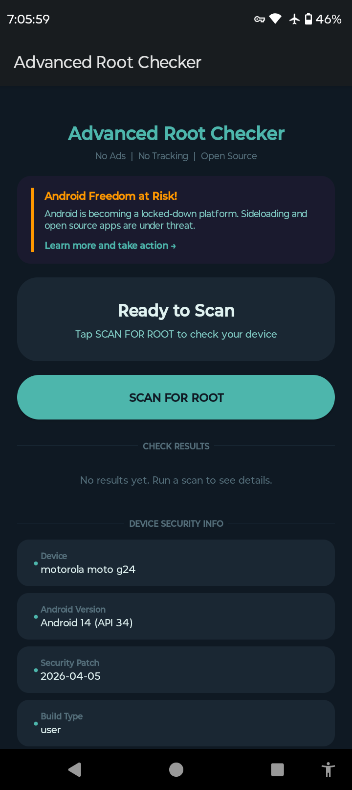
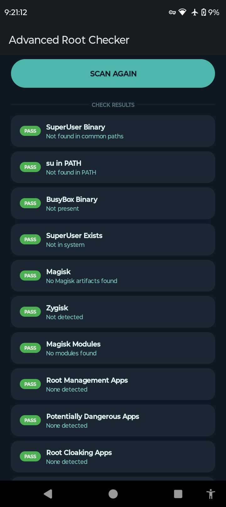
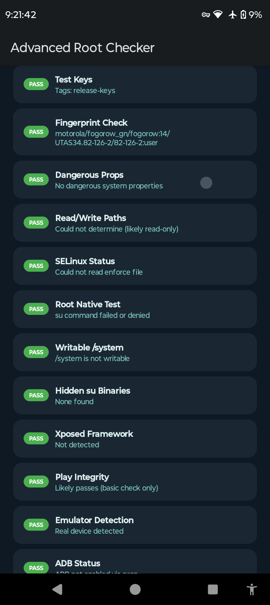
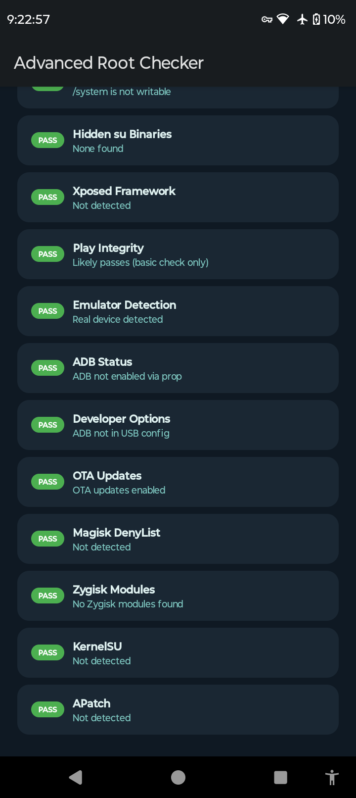

Advanced Root Checker

A free, open-source Android app that detects root indicators 
on your device. All checks run entirely offline.
No internet permission. No ads. No tracking.

---

## Latest Version: 3.1

### Changelog

**Version 3.1**
Detailed Device Info

New device information fields:
- Manufacturer
- Brand
- Model
- Board
- Hardware
- Android ID
- Bootloader
- User
- Host
- Display
- Device codename
- 
**Version 3.0**
Risk Score (0-100 security rating)
Scan History (last 3 scans saved)
Check Explanations (tap any result)
NEW CHECKS (33 total):

Verified Boot status
Knox status (Samsung)
Anti-rollback protection
Treble support
Native capability check

**Version 2.3**
- Added Zygisk detection
- Added Zygisk Modules detection
- Added Magisk Modules count
- Added Magisk DenyList detection
- Added KernelSU detection
- Added APatch detection
- Added Play Integrity check
- Added Emulator detection
- Added ADB Status check
- Added Developer Options check
- Added OTA Updates check
- Total checks increased from 17 to 28

**Version 2.2**
- Added Potentially Dangerous Apps detection
- Added Root Cloaking Apps detection (Shamiko, MagiskHide)
- Added Importance of Root section (What is root, Benefits, Risks, Safety Tips)

**Version 2.1**
- Added Device Security Info section
- Shows Android version and security patch level
- Shows SELinux status, bootloader and screen lock
- Shows CPU architecture and kernel version
- Warnings highlighted in orange

**Version 2.0**
- Complete Material You dark teal UI redesign
- Rounded cards with PASS/FAIL pills
- Animated summary card (green/orange/red)
- Progress bar with percentage counter
- Smooth fade-in animations for results
- App name fixed to Advanced Root Checker

**Version 1.0**
- Initial release
  - 28 root detection checks

---

## Screenshots

---

## Features

- 33 root detection checks
- Device Security Info section
- Importance of Root educational section
- Material You dark teal design
- PASS/FAIL pills for each check
- Animated results and summary card
- 100% offline - no internet permission
- No ads, no tracking, no analytics
- Open source GPL-3.0

---

## Checks Performed

| Check | Description |
|---|---|
| SuperUser Binary | Looks for su in common paths |
| su in PATH | Checks environment PATH for su |
| BusyBox Binary | Detects BusyBox presence |
| SuperUser Exists | Finds SuperUser/SuperSU APKs |
| Magisk | Detects Magisk directories |
| Root Management Apps | Checks for root manager packages |
| Potentially Dangerous Apps | Detects Lucky Patcher and similar |
| Root Cloaking Apps | Detects Shamiko and MagiskHide |
| Test Keys | Checks build signing keys |
| Fingerprint Check | Analyzes build fingerprint |
| Dangerous Props | Checks system properties |
| Read/Write Paths | Checks /system mount mode |
| SELinux Status | Detects permissive SELinux |
| Root Native Test | Attempts su execution |
| Writable /system | Tests /system write access |
| Hidden su Binaries | Finds hidden su binaries |
| Xposed Framework | Detects Xposed installation |
| Zygisk | Detects Zygisk framework |
| Zygisk Modules | Detects modules with Zygisk support |
| Magisk Modules | Counts installed Magisk modules |
| Magisk DenyList | Detects DenyList database |
| KernelSU | Detects KernelSU root solution |
| APatch | Detects APatch root solution |
| Play Integrity Heuristics (Offline) | Approximates a Play Integrity result using local build signals only — not a real API call to Google |
| Emulator Detection | Detects if running on emulator |
| ADB Status | Checks if ADB is enabled |
| Developer Options | Checks USB ADB configuration |
| OTA Updates | Checks if OTA updates are disabled |
---

## Build from Source

### Build on Android with Termux (recommended)

**Step 1 - Install Termux from F-Droid (not Play Store)**

**Step 2 - Install dependencies:**
pkg update && pkg upgrade -y

pkg install openjdk-17 git aapt2 wget unzip git apksigner gradle -y

**Step 3 - Set Java path:**
export JAVA_HOME=$PREFIX/lib/jvm/java-17-openjdk

export PATH=$PREFIX/bin:$PATH

**Step 4 - Make it permanent:**
echo 'export JAVA_HOME=$PREFIX/lib/jvm/java-17-openjdk' > ~/.bashrc
echo 'export PATH=PREFIX/bin:HOME/.local/bin:$JAVA_HOME/bin' >> ~/.bashrc
source ~/.bashrc

**Step 5 - Clone the project:**
git clone https://github.com/Laert-Android/Advanced-Root-Checker

cd Advanced-Root-Checker

**Step 6 - Download Android SDK:**
cd ~

wget https://dl.google.com/android/repository/commandlinetools-linux-11076708_latest.zip

unzip commandlinetools-linux-11076708_latest.zip

mkdir -p ~/android-sdk/cmdline-tools/latest

mv ~/cmdline-tools/* ~/android-sdk/cmdline-tools/latest/

**Step 7 - Set SDK environment:**
echo 'export ANDROID_HOME=$HOME/android-sdk' >> ~/.bashrc
echo 'export PATH=PATH:ANDROID_HOME/cmdline-tools/latest/bin' >> ~/.bashrc
source ~/.bashrc

**Step 8 - Set SDK environment permanently:**
export ANDROID_HOME=$HOME/android-sdk

export PATH=$PATH:$ANDROID_HOME/cmdline-tools/latest/bin

yes | sdkmanager --licenses

sdkmanager "platforms;android-34"

sdkmanager "build-tools;34.0.0"

**Step 9 - Configure project:**
cd ~/Advanced-Root-Checker

gradle wrapper

echo "sdk.dir=$HOME/android-sdk" > local.properties
echo "android.aapt2FromMavenOverride=/data/data/com.termux/files/usr/bin/aapt2" > gradle.properties

**Step 10 - Build the APK:**
./gradlew assembleDebug

**Step 11 - Generate a signing keystore (only needed once):**
keytool -genkey -noprompt 
-keystore ~/my.keystore 
-alias mykey 
-keyalg RSA 
-keysize 2048 
-validity 10000 
-storepass android123 
-keypass android123 
-dname "CN=Dev,OU=Dev,O=Dev,L=City,ST=State,C=US"

**Step 12 - Copy and sign the APK:**
cp app/build/outputs/apk/debug/app-debug.apk ~/RootChecker.apk

apksigner sign 
--ks ~/my.keystore 
--ks-pass pass:android123 
--key-pass pass:android123 
~/RootChecker.apk

**Step 13 - Copy to Downloads and install:**
cp ~/RootChecker.apk /sdcard/Download/RootChecker.apk
Then open your file manager, go to Downloads and tap RootChecker.apk to install.

---

### Notes
- Type the commands one by one to avoid errors
- Steps 1-8 only need to be done once
- For future builds just do Steps 9-13
- If you get SDK location error run Step 9 again
- If you get JAVA_HOME error run Steps 3-4 again
- If you get 'sdkmanager: command not found' run Steps 6 and 7 again before Step 8. The SDK path must be set before running sdkmanager.
- If the build fails in the last step type echo "android.aapt2FromMavenOverride=/data/data/com.termux/files/usr/bin/aapt2" > ~/Advanced-Root-Checker/gradle.properties and try again.

## Build on PC (Windows,Linux)

### Android Studio

**Step 1 - Download Android Studio**
Go to developer.android.com/studio and download for your OS

**Step 2 - Install Java 17**
Android Studio includes its own JDK, no separate install needed

**Step 3 - Clone or download the project**
git clone https://github.com/Laert-Android/Advanced-Root-Checker

**Step 4 - Open in Android Studio**
File -> Open -> select the Advanced-Root-Checker folder

**Step 5 - Wait for Gradle Sync**
Android Studio will automatically download dependencies and sync the project. This may take a few minutes on first open.

**Step 6 - Build the APK**
Build -> Build Bundle(s) / APK(s) -> Build APK(s)

**Step 7 - Find your APK**
Click "locate" in the notification, or find it at:
app/build/outputs/apk/debug/app-debug.apk

**Step 8 - Run on a connected device**
Connect your Android phone via USB with USB debugging enabled, then click the green Run button

---

## Privacy

- No internet permission
- No ads or ad SDKs
- No analytics or tracking
- No data collection of any kind
- All checks run locally on device

---

## Download

- [GitHub Releases](https://github.com/Laert-Android/Advanced-Root-Checker/releases)
- [SourceForge](https://sourceforge.net/projects/advanced-root-checker)
- [XDA Forums](https://xdaforums.com/t/advanced-root-checker-free-open-source-root-detection-app-no-ads-no-tracking-17-checks.4791052/)
- F-Droid (submission pending)

## Community

- [XDA Forums Thread](https://xdaforums.com/t/advanced-root-checker-free-open-source-root-detection-app-no-ads-no-tracking-17-checks.4791052/)
- [GitHub Issues](https://github.com/Laert-Android/Advanced-Root-Checker/issues)

## License

GNU General Public License v3.0 - see [LICENSE](LICENSE)

## Author

Made by [Laert](https://github.com/Laert-Android)
